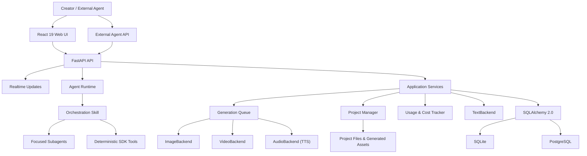
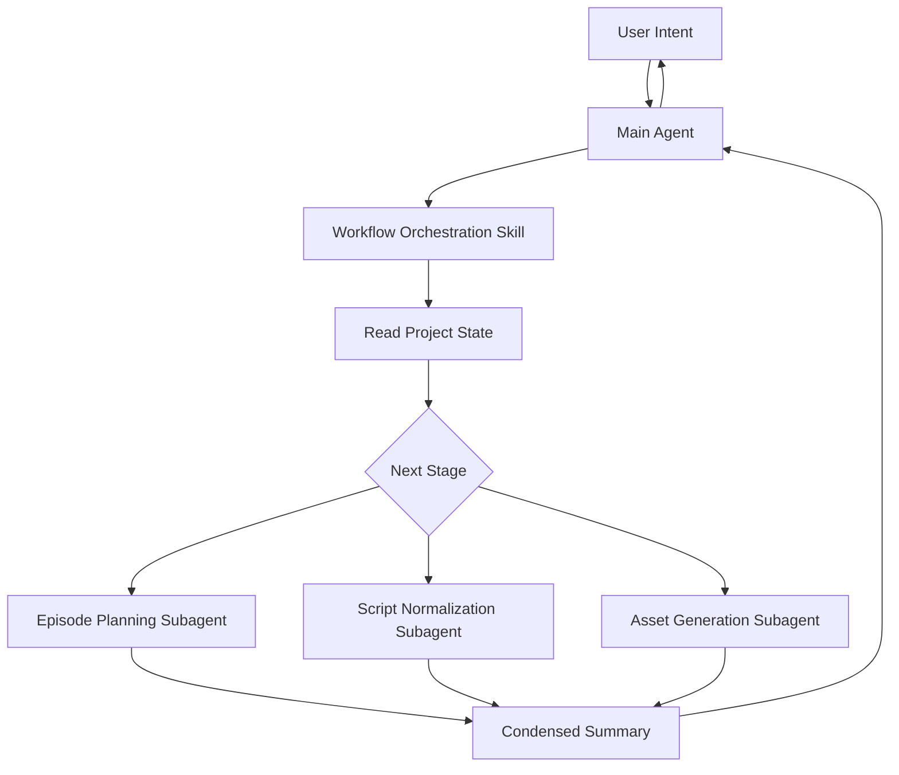
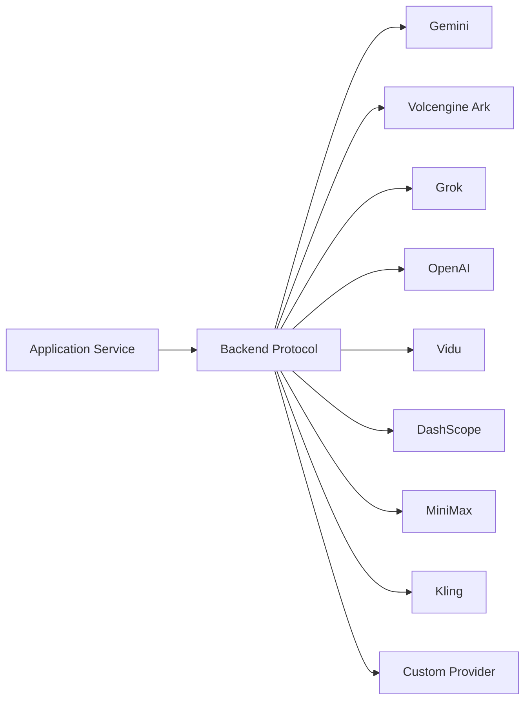

# Architecture {#architecture}

This document describes ArcReel's stable architectural boundaries, primary data flows, and extension points. It does not replace code-level API documentation or record temporary implementation plans.

## 1. Architecture Goals {#goals}

ArcReel's core goal is not to tie the product to any particular model, but to provide an AI video production pipeline that is:

- orchestratable;
- reviewable;
- resumable after interruption;
- provider-agnostic;
- cost-trackable;
- version-preserving;
- ready for continued post-production editing.

## 2. Overall Architecture {#overview}



## 3. Frontend Layer {#frontend-layer}

The frontend uses React 19 and TypeScript. Its primary responsibilities include:

- project listing and creation;
- the project workbench;
- asset previews;
- conversations with the AI assistant;
- task status;
- usage and spend statistics;
- settings and provider management;
- version history;
- project import and export.

The frontend must not handle provider credentials directly or bypass the backend to call models.

## 4. API and Realtime State {#api-and-realtime}

FastAPI provides:

- REST APIs;
- authentication;
- project and asset operations;
- task creation and queries;
- Agent conversations;
- SSE for Agent and project events;
- generation task queries;
- external API Key access.

Agent responses stream through assistant SSE. Terminal project state changes trigger UI refreshes through project event SSE, while task queries provide intermediate generation status and a fallback after disconnection. When deploying behind a reverse proxy, disable proxy buffering for SSE and configure a sufficiently long read timeout.

## 5. Agent Runtime {#agent-runtime}

The Agent Runtime is built on the Claude Agent SDK and follows an “Orchestration Skill + Focused Subagent” structure.



### 5.1 Orchestration Skill {#orchestration-skills}

It is responsible for:

- determining the project's current state;
- selecting the next step;
- calling deterministic tools;
- dispatching Subagents;
- controlling stage boundaries;
- waiting for user confirmation when needed.

The orchestration layer should not perform all content reasoning itself, because doing so would rapidly expand the main context.

### 5.2 Focused Subagents {#focused-subagents}

Each Subagent focuses on one task, such as:

- splitting narration segments;
- normalizing episodic drama scripts;
- splitting reference-to-video units;
- producing a structured script for one episode;
- generating assets.

The first three are script planning tasks, and they also identify the new assets in the episode.

Large amounts of source novel text and intermediate reasoning should remain within the Subagent whenever possible. The main Agent receives summaries and references to results.

### 5.3 Deterministic Tools {#deterministic-tools}

Deterministic operations are better handled by tools or Skills, for example:

- reading and writing project files;
- creating tasks;
- querying status;
- generating structured files;
- composing videos;
- exporting archives.

These operations should not be repeatedly delegated to a language model for free-form generation.

## 6. Application Service Layer {#service-layer}

Application services coordinate:

- projects;
- episodes;
- characters, scenes, and props;
- storyboards;
- media tasks;
- file uploads;
- project import and export;
- Jianying drafts;
- usage and spend;
- diagnostics.

The service layer should depend on stable protocols instead of exposing provider SDK-specific objects to higher layers.

### 6.1 Core Library and Server Boundary {#core-server-boundary}

The backend consists of two packages, the core library `lib/` and the server `server/`. Dependencies may only point from the server to the core library.

- **The core library** holds domain logic and infrastructure: projects and assets, scripts and storyboards, the generation queue, provider calls, billing, database access, and so on. It is unaware that delivery mechanisms such as HTTP, the Agent SDK, or SSE exist.
- **The server** is the delivery layer (HTTP routes, Agent tools, MCP) plus the use-case orchestration shared by multiple entry points; the latter are the application services (`server/services/`).
- Ownership is decided by what a module is, not by who uses it: a domain module used only by the server still belongs to the core library, and a pure domain service that does not depend on the server should move into the core library.
- Routes may call the core library directly; they are not required to go through an application service. An application service is needed only in two cases: the same use case is shared by multiple entry points, or a transaction or compensation must be coordinated across several domain packages.
- Glue bound to the web framework belongs to the server. For example, the message tables and per-locale rendering live in `lib/i18n/`, while the dependency that resolves the locale from the request's `Accept-Language` header and injects a translator into routes lives in `server/i18n.py`.

This boundary is enforced by dependency checks (import-linter, with contracts in `pyproject.toml`): "the core library does not depend on the server" and "the core library does not depend on the HTTP framework" (fastapi / starlette). Neither contract has exemptions. When the core library needs a server capability, the application assembly point injects it: for example, `server/app.py` passes the generation Worker its task executor and resume executor when constructing it.

## 7. Provider Abstraction {#provider-abstraction}

ArcReel uses:

- `TextBackend`
- `ImageBackend`
- `VideoBackend`
- `AudioBackend`

to provide a unified interface across providers.



The abstraction layer standardizes:

- request inputs;
- task creation;
- task polling;
- output locations;
- error handling;
- usage information;
- cost-calculation entry points.

Provider differences still exist, including:

- parameters;
- durations;
- reference image counts;
- asynchronous task states;
- failure semantics;
- billing units.

The correct approach is to encapsulate these differences in backend adapters and capability descriptions, instead of pretending that all providers are identical.

## 8. Generation Queue {#generation-queue}

Image, video, and audio tasks have different cost and latency characteristics, so they use independent concurrency channels.

Key capabilities include:

- asynchronous execution;
- RPM limits;
- independent Image / Video / Audio concurrency;
- persistent state;
- recovery after interruption;
- failure records;
- cancellation of queued tasks;
- project event notifications and task status refreshes.

### 8.1 Why Tasks Must Be Persistent {#why-persistent-tasks}

Model calls can take several minutes. Tasks cannot exist only in memory, because a process restart would lose:

- submitted remote task IDs;
- current status;
- costs;
- output paths;
- error information.

### 8.2 Idempotency {#idempotency}

Task creation and retries should avoid:

- charging twice for the same shot;
- resubmitting locally after the remote task has already succeeded;
- treating a task as failed because SSE disconnected;
- creating identical generation tasks after repeated clicks.

Task identity, persistent state, and provider task IDs are essential to handling these problems.

## 9. Project and Asset Model {#project-and-asset-model}

An ArcReel project is more than a database record; it also includes media assets in the file system.

Typical contents include:

- source novels, screenplays, or merchandise assets;
- project configuration;
- character, scene, and prop definitions;
- reference images;
- storyboards;
- video clips;
- audio;
- composed output;
- version history;
- export archives.

The application data root is resolved in this order:

1. `ARCREEL_DATA_DIR`
2. compatibility variable `AI_ANIME_PROJECTS`
3. default `<repository root>/projects/`

Layout of the data root ([ADR 0088](https://github.com/ArcReel/ArcReel/blob/main/docs/adr/0088-data-root-layered-projects-subdirectory.md)):

```text
<data root>/
├── projects/<project-name>/   projects and generated assets
├── global_assets/             global asset library
├── users/<user_id>/memory/    Agent user memory
├── arcreel.db                 default SQLite database
├── logs/                      file logs
├── vertex_keys/               Vertex credentials
├── trial_runs/                output of endpoint "Test connection" runs
└── runtime/                   generation admission locks, migration completion markers, migration error log
```

- The location of every entry comes only from `DataRootLayout` in `lib/infra/data_root_layout.py`; other code neither builds these paths itself nor derives the data root from a project directory.
- "What is a project" is answered only by `is_project_dir`: a directory under `projects/` whose name matches the project name rule and that contains `project.json`. No other entry in the data root is a project, so new system directories need no prefix or registration list.
- Agent read access to the data root is denied by default; only the current project and the current user's memory are allowed.
- The code directory holds only code and configuration; nothing writes runtime data into it.
- When upgrading from the old layout, the data root layout migration at startup (`lib/infra/data_root_layout_migration.py`) moves entries into the locations above and then writes a completion marker under `runtime/`.

## 10. Database {#database}

ArcReel uses the SQLAlchemy 2.0 asynchronous ORM.

### SQLite {#database-sqlite}

Suitable for:

- personal evaluation;
- local development;
- lightweight single-instance deployments.

WAL, a busy timeout, and foreign key constraints are enabled by default.

### PostgreSQL {#database-postgresql}

Suitable for:

- production environments;
- higher concurrency;
- long-running deployments;
- more mature backup and recovery.

At application startup, Alembic migrations upgrade the database to the current version.

## 11. Version History {#version-history}

Media generation is nondeterministic, so “regenerate” should not simply overwrite old files.

Version history is used to:

- compare different generation results;
- roll back;
- preserve reviewed versions;
- reduce the risk of experimentation;
- provide complete context for project archives.

The service layer should operate through a unified asset version interface rather than allowing each provider adapter to decide how files are overwritten.

## 12. Usage and Cost {#usage-and-cost}

Usage tracking spans:

- text;
- images;
- video;
- TTS;
- different providers;
- different currencies;
- estimates and actuals.

Design principles:

- provider adapters report raw usage;
- cost policies perform conversions;
- different currencies are totaled separately by default;
- whether failed tasks are billed follows the provider's semantics;
- ArcReel's records do not replace official provider invoices.

## 13. Video Composition and Jianying Export {#video-composition-and-export}

After media generation is complete, there are two output paths.

### Edit Timelines {#edit-timelines}

An edit timeline is a named set of editing decisions for one episode. An episode can have multiple timelines, stored under `edit_timelines/episode_{N}/{timeline_id}.json` in the project directory. Each file contains a stable ID, display name, clip number allocators, and immutable revisions recording the author, summary, parent revision, and Agent turn. Timelines are formal content included in project archive exports and imports, rather than artifact manifest entries.

`lib/edit_timeline/` owns creation, listing, reading, batch editing, and the management operations below. The HTTP endpoints are `POST /api/v1/projects/{project_name}/episodes/{episode}/edit-timelines`, `GET /api/v1/projects/{project_name}/edit-timelines`, and `GET /api/v1/projects/{project_name}/edit-timelines/{timeline_id}`. The Agent tools `create_timeline`, `list_timelines`, and `read_timeline` call the same service. Writes use an episode file lock and atomic replacement; Agents cannot write directly into this directory.

Batch editing goes through the Agent tool `edit_timeline`, which calls the service `edit` command. Under the episode file lock, the service reads the latest revision, checks `base_revision`, applies a batch of operations addressed by clip ID, and appends exactly one revision.

Management operations are provided by the same service and shared by the Agent tools and the HTTP endpoints:

- **Copy**: the Agent tool `create_timeline` (`from: "timeline"`) and `POST …/edit-timelines/{timeline_id}/copy`. Copies the content of a given revision (the latest by default) as-is into a new timeline of the same episode, carrying over clip IDs and the number allocators. The new timeline starts at revision 1.
- **Rename**: `rename_timeline` and `PATCH …/edit-timelines/{timeline_id}`. Changes only the display name in the document header. It creates no revision, and final cuts and Jianying drafts do not become stale.
- **Revision history**: `list_revisions` and `GET …/edit-timelines/{timeline_id}/revisions`.
- **Restore**: `restore_revision` and `POST …/edit-timelines/{timeline_id}/restore`. Appends a new revision with the content of an older one and records the source in `restored_from`; history is never rewritten. A restore always applies to the latest revision without optimistic concurrency checks. Its change record is the difference from the latest revision, and when the relative order changes, every clip present in both contents is counted, so edits based on older revisions report more conflicts rather than fewer. A target whose content equals the latest revision returns `revision_unchanged`.
- **Delete**: only `DELETE …/edit-timelines/{timeline_id}`, not exposed to Agents. Timeline IDs are random and never reused, and the identities of final cuts and Jianying drafts hang on the ID, so deletion also removes the timeline's final-cut and draft claims and the `renders/episode_{N}/{timeline_id}/` directory. While a render task for the timeline submitted by the current user is queued or running, the endpoint refuses with `edit_timeline_render_in_progress`.

Each revision records the clip IDs it actually changed. When `base_revision` is stale, the service accumulates the changes from every intervening revision and checks the batch's side effects on both the base and latest content. If none of the involved clips has changed and every clip whose transition the batch sets is followed by the same clip in both revisions, the batch applies on top of the latest revision; otherwise, the write is rejected with `revision_conflict`. Older revisions without a change record use per-revision content diffs.

Inserts, deletes, and moves reset every cut whose neighbours change to a hard cut. At most one clip per video unit carries its narration, and clip numbers are never reused.

Clips reference each video unit's current video and do not automatically follow script additions or deletions. Internal times are integer microseconds. Reads probe actual media durations and return seconds with at most three decimal places, including absolute clip starts, narration intervals, and structural issues. Trims retain their basis version; switching versions makes duration calculations use the full video. Source volume defaults depend on speech ownership. Revisions store transitions, tail holds, and BGM decisions, while subtitle text and narration delivery variants stay outside the edit timeline.

Narration starts at its carrier clip and plays for the measured length of its audio, so it can extend onto the following clips; the `place_narration` operation moves it to another clip of the same video unit. For TTS voiceover projects, reads also report three narration issues; post-production voiceover projects report none of them: missing narration audio (`narration_missing`, blocks only the narrated version); narration overrun (`narration_overrun`, overlapping the next narration or running past the end of the timeline, a warning that affects only the narrated version); and a possible clash with source audio (`narration_source_collision`, narration extending onto a dialogue clip or a clip whose source volume is above 0.3, a warning). The presentation model allows narration audio longer than its video and spreads subtitles over the narration, so Jianying draft export, the preview media layer, the unit preview, and the unit bundle all keep working for such video units.

The edit view previews a timeline by stitching media in the browser from the read result; nothing is rendered on the server. Narration audio and subtitles come from `GET /api/v1/projects/{project_name}/edit-timelines/{timeline_id}/preview-media`, which lists the video units referenced by the latest revision. It uses the project's default narration variant (TTS projects include narration) and takes subtitles from each unit's current presentation, so they share the same split as the Jianying draft; cue times are relative to the unit. The frontend places subtitles on the global timeline per clip with the same rules as the Jianying draft. During playback the global clock follows the video in picture sections; when any media stalls on buffering, the clock and all media pause together. Narration and BGM follow the global clock: small drift is corrected by nudging the playback rate, large drift by seeking. Transitions are approximated with opacity fades in the preview.

"Jump to here" links in Agent replies are plain in-app paths. The chat renderer intercepts same-origin links under `/app` and navigates inside the app; every other link keeps the external-link confirmation. There are two formats, with the project name URL-encoded as a path segment:

- Edit view: `/app/projects/{project}/episodes/{episode_id}?view=edit&tl={timeline_id}&t={seconds}`. `tl` and `t` are optional; `t` is the global time on that edit timeline. The edit view selects the clip at that time and moves the playhead there without starting playback. Both parameters are removed from the address bar once read, and if `tl` points to a timeline that no longer exists, the view shows a notice and stays on the default one.
- Video unit: `/app/projects/{project}/episodes/{episode_id}?unit={unit_id}&t={seconds}`. `t` is optional and is the time within that unit's own video, counted from the start of the video. The unit is selected through the same scroll-focus mechanism the Agent uses and its preview is opened; on narrow layouts the sub-tab holding the preview is brought to the front. With `t`, the preview player starts playing at `t`: a time outside the playable range is clamped, and if the browser blocks autoplay the player waits at that position. Without `t`, nothing plays automatically.

### Final Composition {#final-composition}

A final cut is rendered from one revision of an edit timeline. Its artifact identity is episode + edit timeline + narration version + whether subtitles are burned in. Only the latest file is kept per identity, at `renders/episode_{N}/{timeline_id}/final_cut.{narration}.{subtitles}.mp4`, with a same-named `.render.json` render record beside it that stores the version (incremented on each registration) and the render time. Rendering currently supports only final cuts with no narration and no burned-in subtitles. When an edit timeline contains BGM or blocking issues, the submission is refused before anything is queued.

Rendering runs on the generation queue's `render` lane. The lane is not bound to a provider, its global concurrency is fixed at 1 and not configurable, and it writes no usage records. A render interrupted by a server restart is marked failed instead of being requeued, and temporary files are removed. Rendering uses the bundled ffmpeg: each hard-cut segment is normalized to the project canvas at a fixed 30 fps and encoded separately, where trims and tail holds take effect, and clip boundaries are rounded to the frame grid on cumulative timeline time. Transitions change neither clip boundaries nor the total duration; each window is centered on the cut, half on either side. An overlapping transition makes the previous clip take half a window of source after its out point and the next clip half a window before its in point, and crossfades them with `xfade` inside one segment; when the source runs short, or the previous clip ends in a tail hold, edge-frame stills fill the gap. A non-overlapping transition (fade through black or white) borrows nothing and keeps the cut as a segment boundary: the previous clip fades out over the last half window and the next clip fades in over the first half. `lib/edit_timeline/transitions.py` maps the transition vocabulary to Jianying presets and `xfade` effects. Audio is not segmented: the whole episode is mixed into one audio track using each clip's source volume, which is then muxed with the video segments concatenated by `-c copy`.

`lib/artifacts/rendered_artifact.py` is the registration flow shared by locally rendered artifacts: take the basis snapshot when the task starts, render into a hidden temporary file inside the formal directory, accept it with the media probe (both streams present, durations within tolerance), then forget the previous claim, atomically replace the formal file, write the version record, and finally register it with the snapshot basis. If writing the version record fails, the artifact has no claim and reads missing. The final-cut basis contains only consumed content (the edit timeline ID and revision number, each clip's video version, content digest, and provider-audio switch, the effective trim, hold, source volume, and transition, and the output canvas). As in Jianying drafts, a video whose version record says provider audio was not generated contributes no audio. Registration and currency comparison share one builder in `lib/final_cut/basis.py`. A final cut therefore reads stale when the edit timeline changes during rendering or when an older revision is rendered explicitly. `renders/` is not included in project archives, so final cuts read missing after import.

The HTTP endpoints are `POST /api/v1/projects/{project_name}/edit-timelines/{timeline_id}/final-cut` (optional `revision`, defaulting to the latest revision at submission; returns the task ID) and `GET` on the same path (returns currency, version, and download URL); downloads go through the public media file route. Hidden temporary files, render records, and Jianying draft zip files cannot be read anonymously. The Agent tool `render_final_cut` is declared as a long task: the ArcReel Agent waits for the render and receives a download URL, while external Agents receive a generation batch handle to poll.

### Jianying Draft {#jianying-draft}

Export an editable project structure to:

- adjust clips;
- edit subtitles;
- replace voice-over;
- add music;
- change transitions;
- make manual refinements.

The ability to continue editing is an important difference between ArcReel and generation tools that output only a single video file.

A Jianying draft rendered from an edit timeline is an artifact identified by episode, edit timeline, and narration version (`without_narration` or `with_narration`; the narrated version is available only to TTS voiceover projects), stored at `renders/episode_{N}/{timeline_id}/jianying_draft.{narration}.zip`. Like the final cut, the export is a `render` lane task (`render_jianying_draft`) written through the same basis snapshot → temporary file → acceptance → atomic replacement and registration flow; each artifact identity keeps only its latest file and records a version number. `server/services/presentation/timeline_jianying_draft.py` rejects blocking issues for the selected narration version both before queueing and when the task starts, and shares the final cut's check that refuses edit timelines with BGM; like the final cut, it also refuses an edit timeline with no clips left to export. It then uses each video unit's current presentation as the material layer and maps trims, source volume, tail holds (a still of the out-point frame), transitions (attached by vocabulary to the previous clip's last video segment, which is the out-point still when the clip has a tail hold), the narration track (narrated version only), and the subtitle track (Source Han Sans CN Bold) into the draft. Its basis records the edit timeline revision number, the rendered part of that revision, the aspect ratio, and each unit's presentation basis. Clip reasons do not enter the basis on their own, but any new revision makes a draft exported from an older revision read stale, and so do media changes.

The artifact zip holds only draft files, freeze-frame stills, and a media index, with media paths written as placeholders. The HTTP endpoints are `POST /api/v1/projects/{project_name}/edit-timelines/{timeline_id}/jianying-draft` (optional `revision` and `narration`; an omitted `revision` means the latest revision at submission, and an omitted `narration` defaults to the narrated version for TTS voiceover projects and the non-narrated version otherwise; returns the task ID) and `GET` on the same path (returns currency and version). The download `GET .../jianying-draft/download` checks the project download token, then substitutes the local draft directory and Jianying version (`draft_content.json` for 5.x, `draft_info.json` for 6+) and packs media from the project's version snapshots. The public media file route does not serve draft zip files. The Agent tool `export_jianying_draft` is declared as a long task and is called the same way as `render_final_cut`, but its terminal result carries no download URL. Like final cuts, drafts read missing after an archive import.

### Video Review {#video-review}

The Agent tool `inspect_video_units` lets an Agent review video units by looking at them. For one video version of each video unit (current by default; a historical version can be named, read from that version's snapshot), the server renders contact sheets with the bundled ffmpeg: it first demuxes the per-frame timestamps, samples frames evenly by index, and then extracts the chosen frames in a single decode, so each frame's label is that frame's own start time, on the same time axis as edit timeline in and out points. Each contact sheet holds at most 12 frames with a long edge of at most 2000 px; the header shows the video unit ID and version, and each frame shows the video unit ID and its time. One call returns at most 96 frames, shared evenly across units, with no separate cap on the number of units. Contact sheets are not written to disk; `lib/video_review/` produces them.

Contact sheets return as MCP image content blocks after the text blocks. The declaration's `images` hook supplies the image blocks of the result envelope, and both adapters encode the same envelope, so the ArcReel Agent and external Agents receive identical images rather than file paths. The `model_review` field in the result is reserved for future server-side native video review and is always null for now.

### Presentation Read Model {#presentation-read-model}

Browser preview, editable bundle download, and Jianying draft export do not derive audio, subtitles, or timing independently. They consume one presentation read model that fixes the selected video version, optional TTS version, actual media duration, original-audio policy, subtitle timing, and current or historical status. Subtitles and presentation descriptors for a current selection are materialized under `subtitles/` and `presentations/` respectively and registered in the project Artifact Manifest. Historical selections are read-only and never replace the current materialization.

A manually uploaded video has no generation provenance and uses an explicit raw-only branch: ArcReel preserves the original video, generates no TTS or subtitles, and registers no derived presentation. The video itself is registered in the Artifact Manifest by its uploaded bytes, so its currency changes only with the selected version and the file bytes. All three output entry points therefore share the same selection while keeping unavailable provenance distinct from verified provenance.

## 14. Authentication and External Integrations {#auth-and-integrations}

ArcReel provides:

- username and password login;
- JWT;
- API Keys with an `arc-` prefix;
- a synchronous conversation endpoint for external Agents.

API Keys should be stored as hashes and should not continue to be returned in plaintext after creation.

External Agent integrations should:

- minimize permissions;
- restrict accessible projects;
- log calls;
- support revocation;
- avoid sharing administrator passwords with third-party platforms.

## 15. Sandbox and Security Boundaries {#sandbox-and-security}

Agent tools may access:

- the file system;
- the network;
- subprocesses;
- FFmpeg;
- Bash tools.

ArcReel uses mechanisms such as `bwrap` to restrict these capabilities in supported environments. Docker Compose configures additional permissions for the sandbox, so production deployments must make a clear tradeoff between functionality and host isolation.

Security principles:

- least privilege by default;
- file and network allowlists;
- do not mount the Docker Socket;
- do not mount unnecessary host paths;
- expose only the reverse proxy externally;
- use HTTPS;
- update regularly;
- treat unknown project input as untrusted data.

## 16. Extending ArcReel with a New Provider {#extend-provider}

A complete integration of a new provider usually requires:

1. defining capability and configuration models;
2. implementing the corresponding Backend protocol;
3. standardizing error types;
4. implementing a synchronous or asynchronous task lifecycle;
5. saving remote task IDs;
6. parsing outputs and usage;
7. implementing cost policies;
8. integrating with the Settings page;
9. adding unit and integration tests;
10. updating provider documentation;
11. verifying timeouts and retries.

Do not implement only the happy path. Polling, timeouts, failures, and duplicate submissions for video providers are often more complex than request creation.

## 17. Extending ArcReel with a New Workflow Stage {#extend-workflow-stage}

A new stage should answer:

- what its input is;
- what its output is;
- whether it can be run repeatedly;
- how completion is determined;
- whether user confirmation is required;
- how it recovers after failure;
- whether it incurs costs;
- whether it needs version history;
- what the main Agent, Skill, Subagent, and deterministic tools are each responsible for.

A stage can be orchestrated and resumed reliably only when its completion can be determined unambiguously from project state.

## 18. Architecture Constraints {#constraints}

The following constraints should be maintained over the long term:

- the UI does not call providers directly;
- business services do not depend on objects returned by provider SDKs;
- the Agent does not construct database SQL directly;
- provider adapters do not determine product workflows;
- retries do not bypass idempotency;
- cost records are associated with generation tasks;
- project files and database state can be backed up together;
- specific model names do not enter stable domain interfaces;
- long-text reasoning does not accumulate indefinitely in the main Agent context;
- deterministic operations use tools instead of natural-language generation whenever possible;
- the core library does not depend on the server or the web framework (see [6.1](#core-server-boundary)).

## 19. Related Documentation {#related-docs}

- [Workflows and Modes](../guide/workflows.md)
- [Provider and Model Configuration](../guide/providers.md)
- [Deployment and Operations](../ops/deployment.md)
- [Contributing Guide](./contributing.md)
- [ADR Directory](https://github.com/ArcReel/ArcReel/tree/main/docs/adr)
